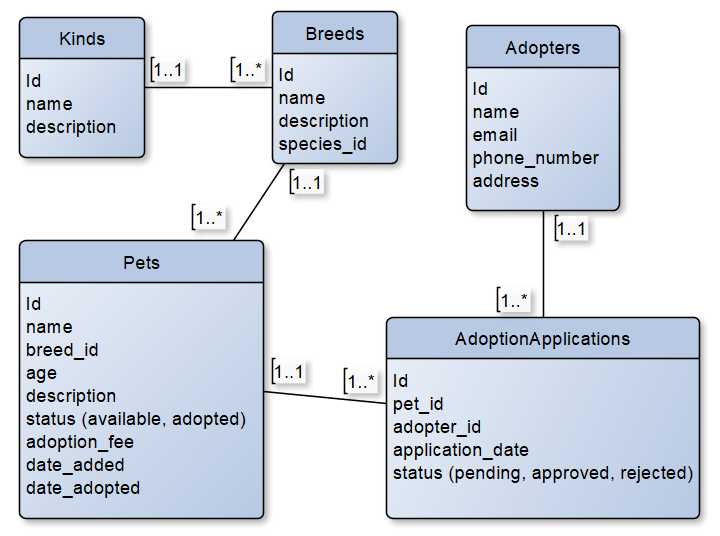

Tema projekta je centar za udomljavanje životinja.
Baza podataka se sastoji od 5 tablica, i to:
- Kinds, 
- Breeds,
- Pets,
- Users,
- AdoptionApplications.

Korištene tehnologije u ovome projektu su:
- Python,
- MySql,
- Flask,
- Kafka,
- Redis,
- Docker,
- JQuery.

Kafka i JQuery su korišteni u pets, kinds i breeds za dodavanje podataka u stvarnom vremenu bez osvježavanja stranice tako da svi korisnici mogu vidjeti nove podatke u stvarnom vremenu, a redis za brže dohvaćanje podataka i manje opterećivanje sustava.

Izgled relacijskog modela baze podataka:

